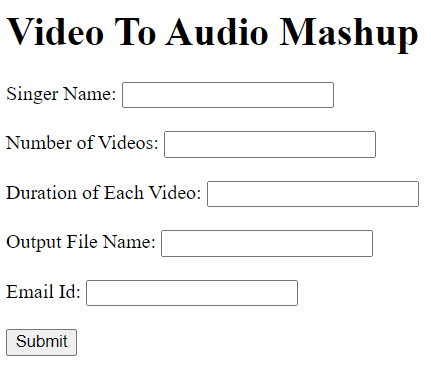

---

# Audio Mashup Project

This application allows users to input details about video processing tasks through a web form. It orchestrates various scripts to download videos, convert them to audio, cut audio clips, merge audio, and send the final result via email.

## Table of Contents
- [Features](#features)
- [Requirements](#requirements)
- [Setup](#setup)
- [Usage](#usage)
- [How It Works](#how-it-works)
- [Contributing](#contributing)
- [License](#license)

## Features
- Download videos from specified singers.
- Convert videos to audio format.
- Cut audio clips to a specified duration.
- Merge audio clips into a single output file.
- Zip and email the final output file.

## Requirements
- Python 3.x
- Flask
- Required libraries:
  - `requests`
  - `pandas`
  - `matplotlib`
  - `sklearn`
  
Install the required libraries using:
```bash
pip install flask requests pandas matplotlib scikit-learn
```

## Setup
1. Clone or download this repository to your local machine.
2. Navigate to the project directory:
   ```bash
   cd path/to/project_directory
   ```

3. Ensure all scripts (`Converterr.py`, `cutter.py`, `downloadder.py`, `Merger.py`, and `zipsend.py`) are present in the same directory.

## Usage
1. **Run the Flask Application**: Open a terminal in the project directory and execute:
   ```bash
   python app.py
   ```

2. **Open Your Web Browser**: Go to `http://127.0.0.1:5000/` to access the input form.


3. **Fill Out the Form**: Provide the following details:
   - **Singer Name**: Name of the singer whose videos you want to process.
   - **Number of Videos**: The number of videos to download.
   - **Duration of Each Video**: Duration of each audio clip in seconds.
   - **Output File Name**: The name of the merged audio output file.
   - **Email Id**: The email address to send the zipped folder.

4. **Submit the Form**: Click the "Submit" button to start processing. The application will execute the scripts in sequence with the provided inputs.

## How It Works
- The application collects user inputs through a web form.
- Upon submission, it calls the `main.py` script with the input parameters.
- `main.py` orchestrates the execution of other scripts for downloading videos, converting them to audio, cutting audio clips, merging audio, and sending the final output via email.

## Contributing
If you'd like to contribute to this project, feel free to submit a pull request or open an issue for discussion.

## License
This project is licensed under the MIT License.

---
